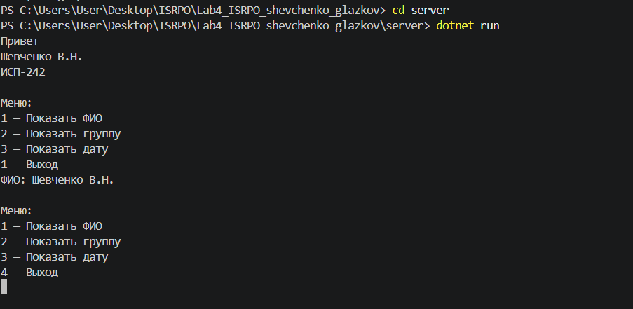
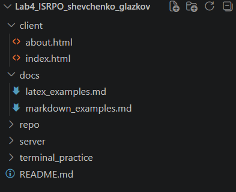

# Лабораторная работа №4. Git, Markdown, терминал и структура проекта

**ФИО:** Шевченко В.Н.  
**Группа:** ИСП-242  
**Дата:** 09.10.2026

## Описание проекта

Учебный проект, в котором закрепляются навыки работы с Git и GitHub,
Markdown-разметкой, LaTeX-формулами, терминалом PowerShell и структурой
full-stack-проекта (frontend + backend + документация).

## Содержание

- [Структура проекта](#структура-проекта)
- [Примеры Markdown](#примеры-markdown)
- [Пример LaTeX](#пример-latex)
- [Ссылка на репозиторий](#ссылка-на-репозиторий)
- [Скриншоты](#скриншоты)
- [Заключение](#заключение)

## Структура проекта

```
Lab4_ISRPO_shevchenko_glazkov/
├── client/                  # frontend
│   ├── index.html
│   └── about.html
├── docs/                    # документация
│   ├── latex_examples.md
│   └── markdown_examples.md
├── repo/                    # скриншоты
├── server/                  # backend (.NET)
│   └── Program.cs
├── terminal_practice/       # практика терминала
│   ├── data.txt
│   └── logs.txt
└── README.md
```

## Примеры Markdown

### Заголовок H3

- маркированный пункт
- ещё один пункт


```bash
git status
```

## Пример LaTeX

Инлайн-формула: $E = mc^2$.

Блочная формула:

$$
\int_0^1 x^2 \, dx = \frac{1}{3}
$$

## Ссылка на репозиторий

[Открыть репозиторий на GitHub](https://github.com/myriton/Lab4_ISRPO_shevchenko_glazkov.git)

## Скриншоты






## Заключение

В ходе работы закреплены навыки работы с Git и GitHub (коммиты, push),
Markdown-разметкой (заголовки, списки, таблицы, alert-блоки),
LaTeX-формулами, терминалом PowerShell и структурой проекта. 