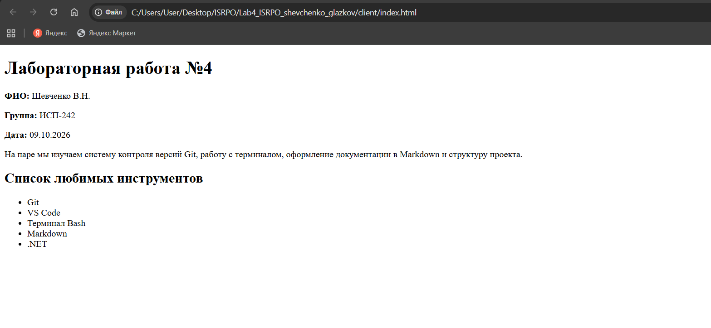

# Заголовок H1
## Заголовок H2
### Заголовок H3
#### Заголовок H4
##### Заголовок H5
###### Заголовок H6

---

**Жирный текст**, *курсив*, ~~зачёркнутый~~, `моноширный`.

- Маркированный пункт 1
- Маркированный пункт 2

1. Нумерованный пункт 1
2. Нумерованный пункт 2

- Вложенный список
  - Уровень 2
    - Уровень 3

> Пример цитаты в Markdown.

```bash
git status
```

| Столбец 1 | Столбец 2 | Столбец 3 |
|:----------|:---------:|----------:|
| A         | B         | C         |



[Внешняя ссылка на GitHub](https://github.com)
[Внутренняя ссылка](#заголовок-h1)

- [x] Сделано
- [ ] Не сделано

> [!NOTE]
> Пример alert-блока GitHub.

Инлайн-формула: $a^2 + b^2 = c^2$

$$
\sum_{i=1}^{n} i = \frac{n(n+1)}{2}
$$